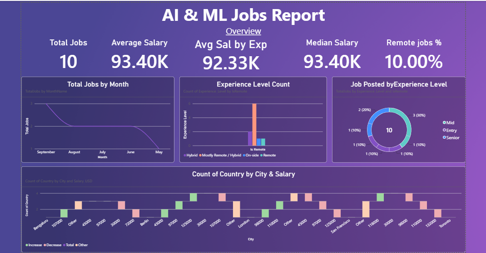
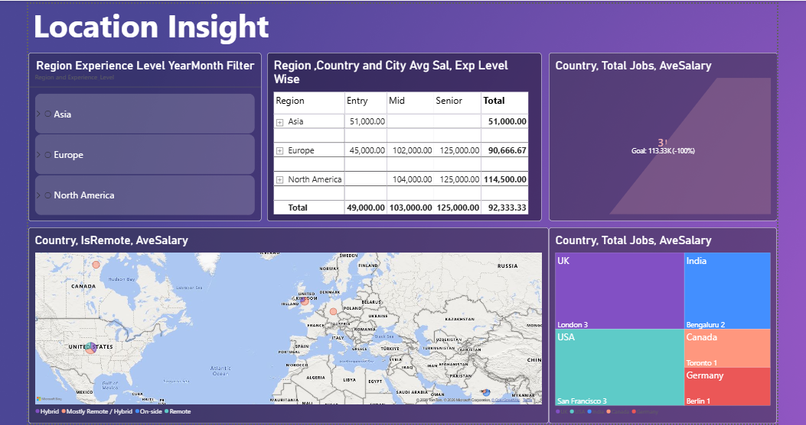
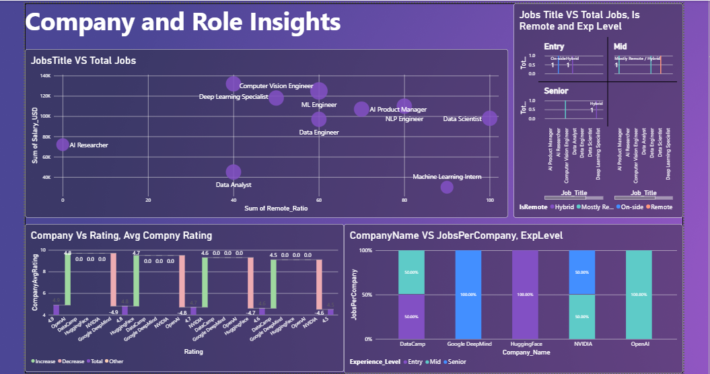
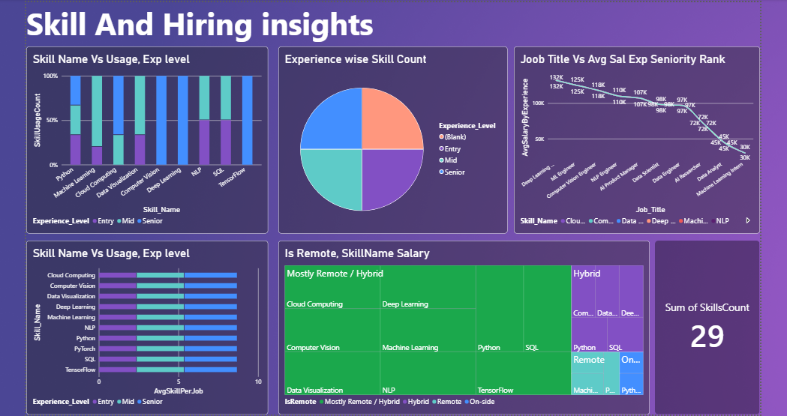
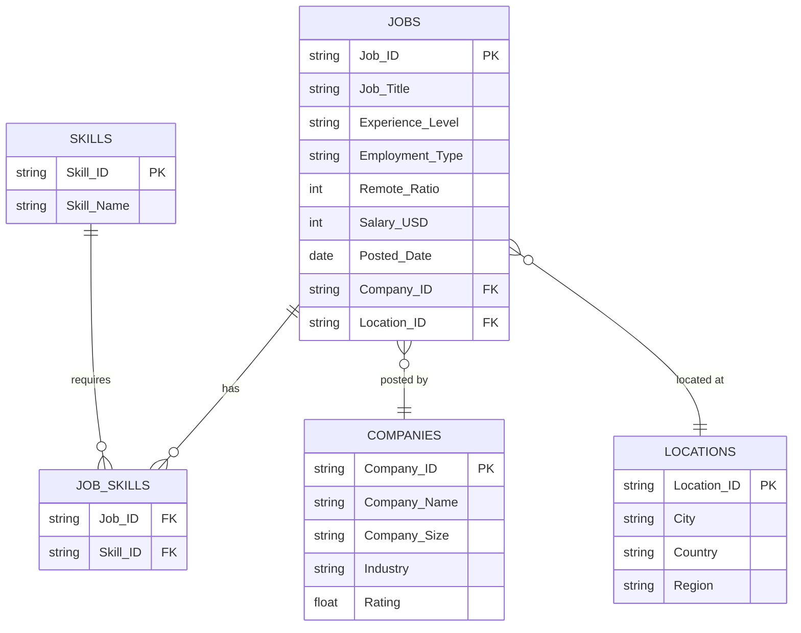

# 📊 AI/ML Jobs Market Analysis Dashboard

> **An interactive Power BI dashboard analyzing AI & Machine Learning job trends** — salaries, in-demand skills, companies, and remote work patterns across the globe.


---

## 🧐 About the Project

This project presents a **Power BI dashboard** that visualizes the current **AI/ML job market** using a well-structured dataset containing **job postings, companies, skills, and locations**. It is designed to help job seekers, recruiters, and analysts answer questions like:

- 💰 **Which roles pay the most?** (Salary analysis by role, experience & employment type)
- 🧠 **Which skills are in highest demand?** (Skill frequency across job postings)
- 🏢 **Which companies are hiring?** (Company ratings & hiring volume)
- 🌍 **Where are AI jobs located?** (City / country / region distribution)
- 🏠 **How common is remote work?** (Remote ratio across jobs)

---

## 🖼️ Dashboard Preview

> Here's a look at the interactive Power BI dashboard — captures the key insights at a glance.

| 📊 Overview | 🌍 Location Insights |
|------------------|------------------|
|  |  |

| 🏢 Company & Role Insights | 🧠 Skill & Hiring Insights |
|------------------|------------------|
|  |  |

---

## ✅ Key Features

- 📊 **Interactive Multi-Page Dashboard** — dynamic slicers & cross-filtering
- 🧩 **Star Schema Data Model** — optimized for DAX calculations
- 💵 **Salary Insights** — average & range analysis by experience level, role, and employment type
- ⭐ **Company Analysis** — ratings, industry, and hiring trends
- 🧠 **Skill Demand Analysis** — top in-demand skills across all postings
- 🌍 **Geographic Analysis** — job distribution across regions & cities
- 🏠 **Remote Work Trends** — remote ratio analysis per job
---

## 📂 Dataset Overview

The dataset follows a **Star Schema** design with **1 fact table (Jobs)**, **3 dimension tables (Companies, Locations, Skills)**, and **1 bridge table (Job_Skills)** for the many-to-many relationship between jobs and skills.

| Table | Type | Rows | Description |
|-------|------|------|-------------|
| `Jobs.csv` | 📘 Fact | 10 | Job postings with salary, experience, employment type, remote ratio & posted date |
| `Companies.csv` | 📗 Dimension | 5 | Hiring companies (size, industry, rating) |
| `Locations.csv` | 📗 Dimension | 5 | Job locations (city, country, region) |
| `Skills.csv` | 📗 Dimension | 10 | Skills required for AI/ML roles |
| `Job_Skills.csv` | 🔗 Bridge | 29 | Links jobs to their required skills |

### Table Schemas

| Jobs.csv | |
|----------|-|
| `Job_ID` | Unique job identifier |
| `Job_Title` | Role name (e.g., Data Scientist, ML Engineer) |
| `Experience_Level` | Entry / Mid / Senior |
| `Employment_Type` | Full-time / Contract / Internship |
| `Remote_Ratio` | % of remote work allowed (0–100) |
| `Salary_USD` | Annual salary in USD |
| `Posted_Date` | Date the job was posted |
| `Company_ID` | FK → `Companies.csv` |
| `Location_ID` | FK → `Locations.csv` |

| Companies.csv | |
|---------------|-|
| `Company_ID` | Unique company identifier |
| `Company_Name` | Company name |
| `Company_Size` | Small / Medium / Large |
| `Industry` | Industry sector |
| `Rating` | Company rating (out of 5) |

| Skills.csv | | Locations.csv | |
|---|---|---|---|
| `Skill_ID` | Unique skill identifier | `Location_ID` | Unique location identifier |
| `Skill_Name` | Skill name (e.g., Python, SQL) | `City` | City name |
| **Job_Skills.csv** | | `Country` | Country code |
| `Job_ID` | FK → `Jobs.csv` | `Region` | Continent / region |
| `Skill_ID` | FK → `Skills.csv` | | |
---

## 🧩 Data Model (Star Schema)



---

## 💡 Key Insights Observed

- 🐍 **Python is the king** — required in **9 out of 10** job postings.
- 🎓 **Salary grows with experience** — Senior roles (avg ≈ **$125,000**) pay ~40% more than Mid-level roles.
- 🚀 **Deep Learning Specialist is the highest-paid role** at **$132,000**.
- 🌏 **North America (US & Canada) drives the market** — most postings are based there.
- 🏠 **Remote-friendly market** — many postings offer **50%+ remote work ratio**.
- ⚖️ **Hiring is led by industry giants** like **OpenAI, Google DeepMind, and NVIDIA**.

---

## 🛠️ Tech Stack & Tools

| Tool | Purpose |
|------|---------|
| **Power BI Desktop** | Dashboard design, DAX measures & visualizations |
| **Power BI Model View** | Star-schema relationships & data modeling |
| **CSV** | Raw data files |
| **Git & GitHub** | Version control & project hosting |
---

## 🚀 How to Use

1. **Clone this repository:**
   ```bash
   git clone https://github.com/<your-username>/AI_ML_Jobs_Dataset.git
   ```
2. **Install** [Power BI Desktop](https://powerbi.microsoft.com/desktop) (free).
3. **Open** the file `AI_ML_Job_Dashboard.pbix`.
4. All datasets are already connected via **Power Query** — just click `Refresh` if needed.
5. Explore the dashboard pages, apply slicers, and drill into the insights!

---

## 📁 Project Structure

```
AI_ML_Jobs_Dataset/
├── 📊 AI_ML_Job_Dashboard.pbix    # Power BI dashboard file
├── 📄 Companies.csv                # Company dimension table
├── 📄 Jobs.csv                     # Job postings (fact table)
├── 📄 Job_Skills.csv               # Bridge table (jobs ↔ skills)
├── 📄 Locations.csv                # Location dimension table
├── 📄 Skills.csv                   # Skills dimension table
├── 📸 screenshots/                 # (Optional) Dashboard preview images
└── 📖 README.md                    # You are here
```

---

## 🔮 Future Enhancements

- 📈 Add **time-series analysis** of salary trends across months
- 🏷️ Add **DAX measures** for dynamic KPIs (e.g., YTD hiring, avg salary by skill)
- 🗺️ Add an **interactive map visual** for global job distribution
- 🔁 Expand the dataset with **more rows** (scrape live job boards like LinkedIn / Indeed)
- 🎯 Add a **"Salary Estimator"** page using slicer-driven DAX

---

## 👨‍💻 Author

**Vikas Gupta**

[](https://github.com/your-username)
[](https://linkedin.com/in/your-profile)
[](mailto:your.email@example.com)

> ⭐ If you find this project useful, don't forget to give it a **star**!

---

## 📄 License

This project is licensed under the **MIT License**. See the [LICENSE](LICENSE) file for details.

---

*Made with ❤️ and Power BI*